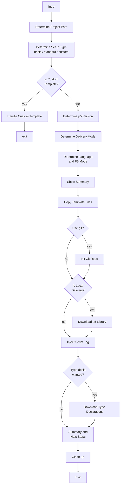

Here is a flowchart of the process in scaffold.

Warning: This may well be out of date - last revised from scaffold.js on 2025-12-20

```mermaid
    flowchart TD
    
    intro[Intro] --> determinePath[Determine Project Path]
    determinePath --> determineSetupType[Determine Setup Type <br>basic / standard / custom]
    determineSetupType --> isCTemplate{is Custom<br>Template?}
    isCTemplate --> |yes| handleCustomTemplate[Handle Custom Template]
    isCTemplate --> |no|determineP5Version[Determine p5 Version]
    handleCustomTemplate --> exit[exit];
    determineP5Version --> determineDeliveryMode[Determine Delivery Mode]
    determineDeliveryMode --> determineLanguageAndP5Mode[Determine Language <br>and P5 Mode]
    determineLanguageAndP5Mode --> showSummary
    showSummary[Show Summary] --> copyTemplateFiles    
    copyTemplateFiles[Copy Template Files] --> isUseGit{Use git?}
    isUseGit --> |yes| initGitRepo
    isUseGit --> |no| isLocalDeliveryMode{is Local <br>Delivery?}
    initGitRepo[Init Git Repo] --> isLocalDeliveryMode    
    isLocalDeliveryMode --> |yes| dloadP5Library 
    isLocalDeliveryMode --> |no| injectScriptTag
    dloadP5Library[Download p5 Library] --> injectScriptTag    
    injectScriptTag[Inject Script Tag] --> isDloadTypeDecls{Type decls<br>wanted?}
    isDloadTypeDecls --> |yes|dloadTypeDecls[Download Type Declarations]
    isDloadTypeDecls --> |no|showSummaryAndNextSteps[Summary and<br>Next Steps]
    dloadTypeDecls --> showSummaryAndNextSteps
    showSummaryAndNextSteps --> cleanUp[Clean up]
    cleanUp --> exit2[Exit]
```