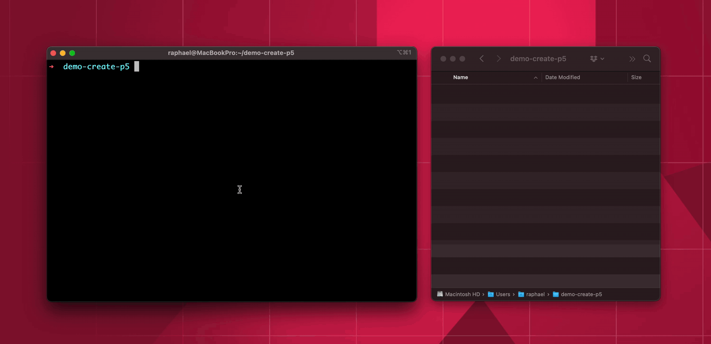

# create-p5js

A scaffolding tool for quickly creating and managing [p5.js](https://p5js.org/) projects using the `npm create` convention.

Setting up a p5.js project from scratch is not very hard, but if you do it often it can become repetitive and time-consuming. This tool gives you ready-made templates, configuration options, and a simple way to pick and switch the p5.js version used.

Simply put: spend less time configuring your project and more time creative coding with p5.js 🌸



## Creating Your First p5.js Project

With NPM:

```bash
npm create p5js
```

With Yarn:

```bash
yarn create p5js
```

With PNPM:

```bash
pnpm create p5js
```

With NPX:

```bash
npx create-p5js
```

With Bun:

```bash
bun create p5js
```

With Deno:

```bash
deno init --npm p5js
```

Then follow the prompts to set up your new p5.js project.

## Using Command Line Options

You can also directly specify the project name, language, and mode via additional command line options. For example, to scaffold a p5.js + TypeScript project with instance mode, run:

```bash
# npm 7+, extra double-dash is needed:
npm create p5js my-sketch -- --language typescript --p5-mode instance

# yarn
yarn create p5js my-sketch --language typescript --p5-mode instance

# pnpm
pnpm create p5js my-sketch --language typescript --p5-mode instance

# Bun
bun create p5js my-sketch --language typescript --p5-mode instance
```

Currently supported options include:

- **Language**: `javascript` (default) or `typescript`
- **p5.js Mode**: `global` (default) or `instance`

You can use `.` for the project name to scaffold in the current directory.

### Additional Options

**Use default settings:**

```bash
npm create p5js -- --yes
```

This will use default values (random project name like `flamboyant-duck`, language: `javascript`, p5.js mode: `global`, version: `latest`, delivery mode: `cdn`).

**Run silently with defaults:**

```bash
npm create p5js -- --silent
```

This behaves like `--yes` but suppresses console output (useful for scripts or tests).

**Specify p5.js version:**

```bash
npm create p5js my-sketch -- --version 1.9.0
```

**Choose delivery mode (CDN or local files):**

```bash
npm create p5js my-sketch -- --mode local
```

### Updating Existing Projects

To update an existing p5.js project created with `create-p5js`, navigate to the project directory and run:

```bash
npx create-p5js update
```

This command will let you update the p5.js version and/or mode, applying them to your project while preserving your custom sketch code.

> [!NOTE]
> The `update` command only works for projects originally created with `create-p5js` (i.e., those containing a `.p5-config.json` file).

## Community Templates

You can also use a remote Git repository as a community template by using the `--template` option with a GitHub repository shorthand or full git URL.

```bash
# Using GitHub shorthand (user/repo)
npm create p5js my-project -- --template user/repo

# Using full git URL
npm create p5js my-project -- --template https://github.com/user/repo.git
```

For example:

```bash
npm create p5js my-project -- --template nbogie/p5-v2-ts-global-mode-starter
```

This uses [degit](https://github.com/Rich-Harris/degit) to clone the template repository.

> [!NOTE]
> When using community templates, the `--language` and `--p5-mode` flags are not used. The template defines its own structure.

You can also specify a subfolder inside a repository or point directly at a single file. Examples:

```bash
# Whole repository (existing example)
npm create p5js my-project -- --template user/repo

# Subfolder inside a repository (uses the specified subpath)
npm create p5js my-project -- --template user/repo/path/to/template

# GitHub tree URL with branch and subfolder
npm create p5js my-project -- --template "https://github.com/user/repo/tree/main/path/to/template"

# Single file inside a repository (downloads just that file)
npm create p5js my-project -- --template user/repo/path/to/file.js
```

Note: Single-file templates will download the specified file into your new project directory — they do not create additional scaffold files. For full project scaffolding prefer a repository or subfolder template.

The tool support the full range of degit syntax for specifying branches, tags, and commit hashes. See the [degit documentation](https://github.com/Rich-Harris/degit).

We also added support for Codeberg repositories using the same syntax.

## Troubleshooting

### Hints or Autocomplete Not Working in VS Code

If you're not seeing p5.js autocomplete or type hints in VS Code after setup, restart the TypeScript language server:

1. Open the Command Palette (F1 or Cmd/Ctrl+Shift+P)
2. Type "restart" and select **TypeScript: Restart TS Server**

This forces VS Code to reload `jsconfig.json` and recognize the type definitions in the `types/` folder.

## Acknowledgment

This project builds upon the work of the p5.js community. Thanks to all contributors and maintainers of p5.js. Thanks also to [@nbogie](https://github.com/nbogie) and [@davepagurek](https://github.com/davepagurek) for their suggestions and feedback.

## Disclaimers

- This tool is provided "as is" without warranty of any kind. Use it at your own risk, and always back up your projects before applying updates.
- The create-p5js project is not an official p5.js or Processing Foundation release, though it aims to support and enhance the p5.js ecosystem.

## License

This project is licensed under the [LGPL-2.1 License](https://www.gnu.org/licenses/old-licenses/lgpl-2.1.html), with the exception of the code templates (see below). Read the [LICENSE](LICENSE) file for details.

The code templates provided in this repository are released under the Creative Commons CC0 1.0 Universal ([CC0 1.0](https://creativecommons.org/publicdomain/zero/1.0/)) Public Domain Dedication. They can be freely used, modified, and distributed without restriction.

## Generative Code Disclosure

Large portions of this project were generated with the assistance of generative coding tools (mainly Claude Code). While efforts have been made to ensure accuracy and quality, users should independently verify any LLM-generated content.
